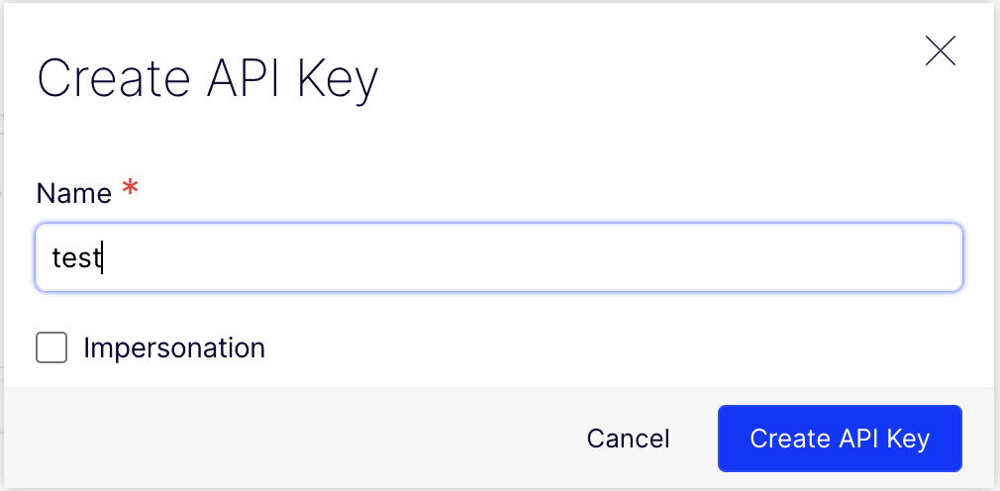
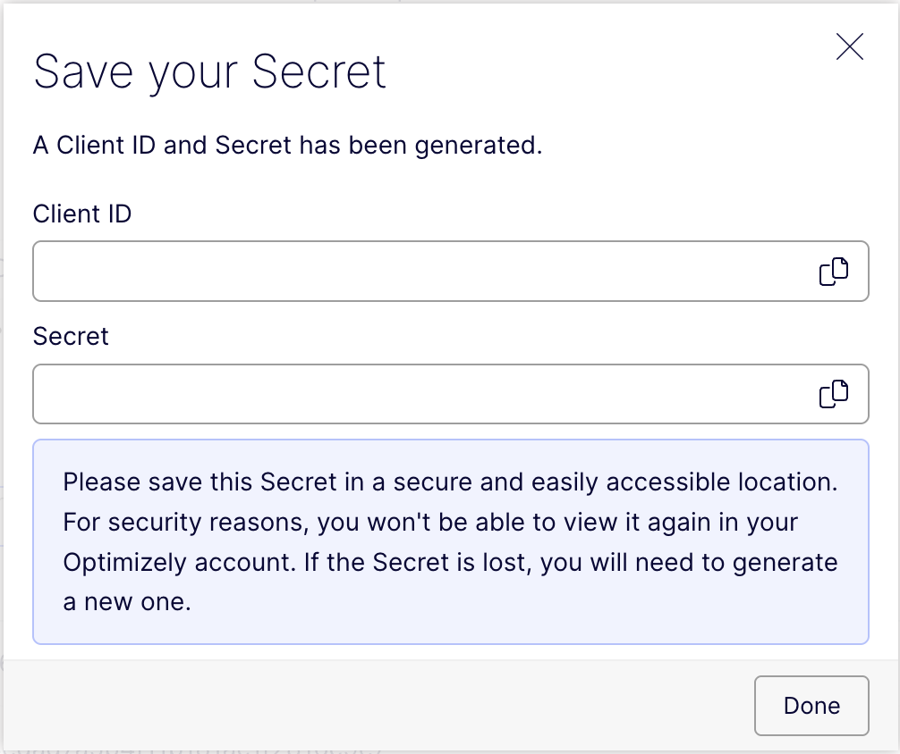

# Setup

In this page you will learn how to setup the CLI to connect it to your CMS instance

## Step 1. Create a API Client in the CMS

You first need to connect the CLI to the Optimizely CMS API.

1. Go to your CMS instance `https://<something>.cms.optimizely.com` &rarr; Settings &rarr; API Keys. Click "Create API key"

2. In the Create API dialog, give a name and click "Create API key"

   

3. You will see Client ID and Client Secret, which you will need in the next steps

   

## Step 2. Create environment variables

Create an `.env` file in the root of your project with the following content:

```ini
OPTIMIZELY_CMS_CLIENT_ID=<the client id>
OPTIMIZELY_CMS_CLIENT_SECRET=<the client secret>
```

> [!WARNING]
> Never commit your `.env` file with tokens to version control.

## Step 3. Check the connection

Use the command to check that the connection is correct:

```
npx @episerver/cms-cli@latest login
```

## Next steps

Now you are ready to start [modelling your data](./3-modelling.md).

---

## Advanced topics

### Non-production environment

The CLI uses the production API endpoints by default (https://api.cms.optimizely.com). If you want to use a different domain (for example https://api.cmstest.optimizely.com), configure it using the environment variable `OPTIMIZELY_CMS_API_URL`:

```ini
OPTIMIZELY_CMS_API_URL=https://api.cmstest.optimizely.com
```

[Read more about environment variables for the CLI](../packages/optimizely-cms-cli/docs/environmental-variables.md)
