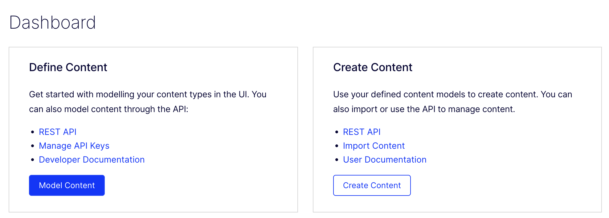
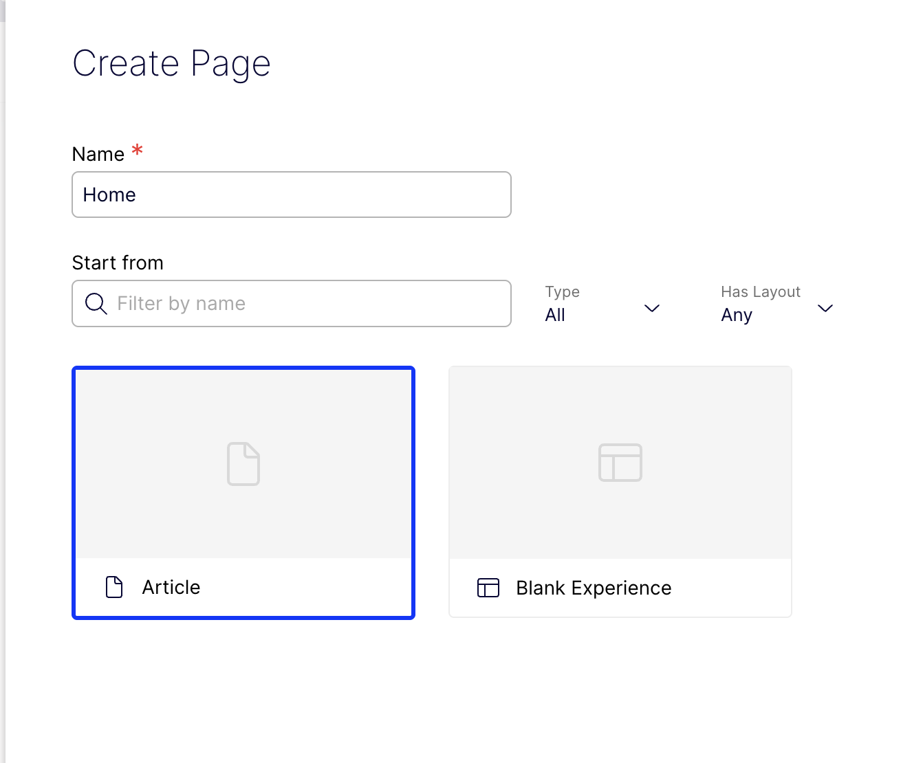
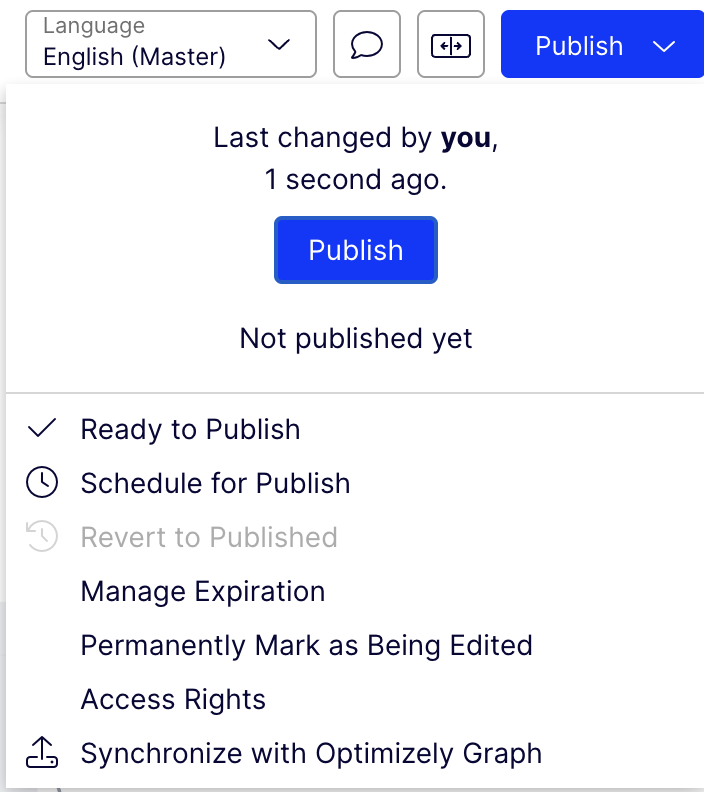
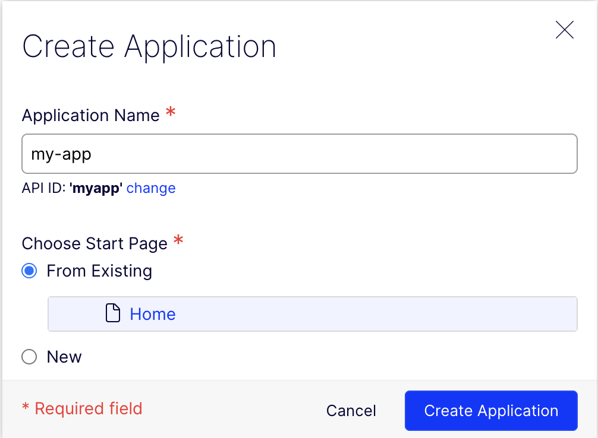

# Create content

In this page, you will learn to create content in the CMS. Once you created it, you will fetch it using the SDK in the next steps

## Step 1. Create a "home" content with type Article

1. Go to your CMS and click "Create Content"

   

2. Put "Home" as name and select content type Article

   

3. Fill some content
4. Click "Publish" &rarr; "Publish Content"

   

## Step 2. Create an application

1. Go to your CMS &rarr; Settings &rarr; Application
2. Click "Create Application"
3. Write `my-app` as Application Name and select "From Existing &rarr; Home" as Start Page

   

## Step 3. Change the "home" URL

1. Go to your CMS &rarr; Content &rarr; Home
2. Scroll down and under "Name in URL" click "Change"
3. Leave the field blank.
4. Click "Publish" &rarr; "Publish Content"

## Next steps

Now you are ready to [fetch the content](./5-fetching.md) you just created.
